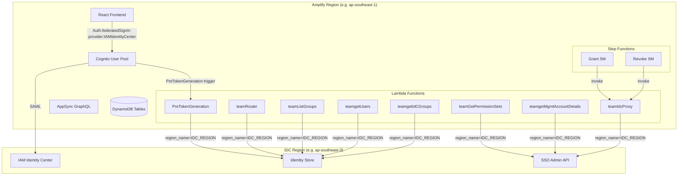
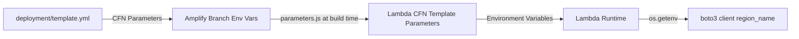

# Design Document: Cross-Region IDC Support

## Overview

The TEAM application currently assumes that Amplify backend resources and IAM Identity Center (IDC) are deployed in the same AWS region. This design enables cross-region operation by making the IDC region configurable at deployment time and ensuring all backend components — Lambda functions, Step Functions, and the deployment template — target the correct region for IDC API calls.

The changes fall into six categories:
1. **Lambda boto3 client configuration** — pass `region_name` from an `IDC_REGION` environment variable when creating `identitystore` and `sso-admin` clients
2. **Explicit SSO instance configuration** — use `INSTANCE_ARN` and `IDENTITY_STORE_ID` env vars directly instead of calling `ListInstances` (which returns empty results from a non-IDC region)
3. **Username resolution** — handle both same-region (`idc_<userName>`) and cross-region (`iamidentitycenter_<email>`) Cognito username formats by splitting on the first underscore and using a dual-lookup strategy (userName then email)
4. **Approver ID construction** — the `approver_ids` field is used by AppSync `@auth` owner-based authorization to determine which approvers can read/update requests. The value must match the approver's Cognito username exactly. In cross-region, the Cognito username prefix changes from `idc_` to `iamidentitycenter_`, so the hardcoded `"idc_"` prefix in `get_approvers()` must be updated.
5. **Step Functions proxy pattern** — route `sso-admin` account assignment calls through the `teamIdcProxy` Lambda, which creates a region-aware boto3 client
6. **Deployment plumbing** — propagate `IDC_REGION`, `INSTANCE_ARN`, and `IDENTITY_STORE_ID` from the CloudFormation deployment template through Amplify env vars to each Lambda's CloudFormation template

When IDC is in the same region as Amplify, the default values work transparently — no additional configuration is needed.

## Current State vs Design (Gap Analysis)

This section documents what already exists in the codebase (from teammate's commits) and what still needs work.

### Already Done
| Design Area | Status | Details |
|-------------|--------|---------|
| boto3 `region_name` in Lambda code | ✅ Done | All 8 Lambdas already read `IDC_REGION` env var and pass `region_name=idc_region` |
| SSO instance env var pattern | ✅ Done | All 7 Lambdas that need SSO instance details check `INSTANCE_ARN`/`IDENTITY_STORE_ID` first |
| `get_user()` dual-lookup | ✅ Done | Both PreTokenGeneration and teamRouter have userName→email fallback |
| Step Functions IDC proxy | ✅ Done | State machines already invoke `teamIdcProxy` for account assignments |
| Frontend direct provider sign-in | ✅ Done | `Auth.federatedSignIn({ provider: "IAMIdentityCenter" })` in App.js |
| `deployment/template.yml` parameters | ✅ Done | `idcRegion`, `instanceArn`, `identityStoreId` params exist and propagate to Amplify branch env vars |

### Remaining Gaps
| Gap | Impact | Fix |
|-----|--------|-----|
| `IDC_REGION` default fallback hardcoded to `'ap-southeast-3'` | Same-region deployments without `IDC_REGION` set would incorrectly target Jakarta instead of the Lambda's own region | Change default from `'ap-southeast-3'` to `os.environ.get('REGION')` in all 8 Lambdas |
| teamRouter `[4:]` username prefix stripping | Cross-region usernames (`iamidentitycenter_<email>`) produce garbage when sliced at position 4 (`identitycenter_user@example.com`) | Change to `split("_", 1)[1]` |
| `get_approvers()` hardcoded `"idc_"` prefix | `approver_ids` stored in DynamoDB won't match the approver's Cognito username in cross-region, breaking AppSync `@auth` owner-based authorization — approvers won't be able to see or approve requests | Must construct `approver_id` using the actual Cognito username prefix |
| `parameters.js` missing IDC env var propagation | Only `teamRouter` and `teamIdcProxy` CFN templates have `idcRegion`/`instanceArn`/`identityStoreId` parameters. The other 6 Lambdas rely on the hardcoded Python default | Add `IDC_REGION`, `INSTANCE_ARN`, `IDENTITY_STORE_ID` propagation in `parameters.js` and add corresponding CFN template parameters to all affected Lambdas |

## Architecture



### Configuration Flow



The three configuration values flow through the stack:
1. `deployment/template.yml` defines `idcRegion`, `instanceArn`, `identityStoreId` as CFN parameters with defaults
2. `AmplifyBranch` resource sets them as environment variables (`IDC_REGION`, `INSTANCE_ARN`, `IDENTITY_STORE_ID`)
3. `parameters.js` (Amplify build script) reads them and writes to each Lambda's `parameters.json`
4. Each Lambda's CloudFormation template reads from `parameters.json` and sets them as Lambda environment variables
5. Lambda code reads via `os.getenv('IDC_REGION')`, `os.getenv('INSTANCE_ARN')`, `os.getenv('IDENTITY_STORE_ID')`

## Components and Interfaces

### 1. Lambda Functions — boto3 Client Configuration

Each Lambda that calls IDC APIs reads `IDC_REGION` from its environment and passes it as `region_name` to boto3 client creation:

```python
idc_region = os.getenv('IDC_REGION', os.environ.get('REGION', 'us-east-1'))
client = boto3.client('identitystore', region_name=idc_region)
client = boto3.client('sso-admin', region_name=idc_region)
```

The default fallback uses the Lambda's own `REGION` env var (set by Amplify to `AWS::Region`), so same-region deployments work without setting `IDC_REGION`.

**Current state:** All 8 Lambdas already have `idc_region = os.getenv('IDC_REGION', 'ap-southeast-3')` — the hardcoded `'ap-southeast-3'` default must be changed to `os.environ.get('REGION')` for same-region compatibility.

**Affected Lambda functions:**
| Lambda | IDC APIs Used | Client Types |
|--------|--------------|--------------|
| `team06dbb7fcPreTokenGeneration` | `identitystore:GetUserId`, `GetGroupId`, `ListGroupMembershipsForMember` | `identitystore`, `sso-admin` (for ListInstances fallback) |
| `teamRouter` | `identitystore:GetUserId`, `DescribeUser`, `ListGroupMembershipsForMember`, `ListGroupMemberships`; `sso-admin:ListInstances`, `DescribePermissionSet` | `identitystore`, `sso-admin` |
| `teamGetPermissionSets` | `sso-admin:ListPermissionSets`, `DescribePermissionSet`, `ListPermissionSetsProvisionedToAccount` | `sso-admin` |
| `teamListGroups` | `identitystore:ListGroupMemberships` | `identitystore`, `sso-admin` (for ListInstances fallback) |
| `teamgetUsers` | `identitystore:ListUsers` | `identitystore`, `sso-admin` (for ListInstances fallback) |
| `teamgetIdCGroups` | `identitystore:ListGroups` | `identitystore`, `sso-admin` (for ListInstances fallback) |
| `teamgetMgmtAccountDetails` | `sso-admin:ListInstances`, `ListPermissionSetsProvisionedToAccount` | `sso-admin` |
| `teamIdcProxy` | `sso-admin:CreateAccountAssignment`, `DeleteAccountAssignment` | `sso-admin` |

### 2. SSO Instance Configuration Pattern

Each Lambda that needs the SSO instance ARN or Identity Store ID uses a configuration-first pattern:

```python
def get_identity_store_id():
    identity_store_id = os.getenv('IDENTITY_STORE_ID')
    if identity_store_id:
        return identity_store_id
    # Fallback: discover via API (works only when called from IDC region)
    client = boto3.client('sso-admin', region_name=idc_region)
    response = client.list_instances()
    return response['Instances'][0]['IdentityStoreId']

def list_existing_sso_instances():
    instance_arn = os.getenv('INSTANCE_ARN')
    identity_store_id = os.getenv('IDENTITY_STORE_ID')
    if instance_arn and identity_store_id:
        return {'InstanceArn': instance_arn, 'IdentityStoreId': identity_store_id}
    # Fallback: discover via API
    client = boto3.client('sso-admin', region_name=idc_region)
    response = client.list_instances()
    return response['Instances'][0]
```

This pattern is already implemented in the teammate's code for several Lambdas. The design ensures all seven affected Lambdas follow this pattern consistently.

### 3. Username Resolution — Dual-Lookup Strategy

Cross-region SAML federation changes the Cognito username format:
- **Same-region**: `idc_<IDC_userName>` (e.g., `idc_jdoe`)
- **Cross-region**: `iamidentitycenter_<email>` (e.g., `iamidentitycenter_jdoe@example.com`)

The prefix varies, but the delimiter is always the first underscore. The extraction logic:

```python
user = event["userName"].split("_", 1)[1]
```

This produces:
- `idc_jdoe` → `jdoe` (IDC userName)
- `iamidentitycenter_jdoe@example.com` → `jdoe@example.com` (email)

The `get_user()` function then uses a dual-lookup strategy:

```python
def get_user(username):
    client = boto3.client('identitystore', region_name=idc_region)
    # Try by userName first (works for same-region: "jdoe")
    try:
        response = client.get_user_id(
            IdentityStoreId=sso_instance,
            AlternateIdentifier={'UniqueAttribute': {
                'AttributePath': 'userName', 'AttributeValue': username
            }}
        )
        return response['UserId']
    except Exception:
        pass
    # Fallback: try by email (works for cross-region: "jdoe@example.com")
    try:
        response = client.get_user_id(
            IdentityStoreId=sso_instance,
            AlternateIdentifier={'UniqueAttribute': {
                'AttributePath': 'emails.value', 'AttributeValue': username
            }}
        )
        return response['UserId']
    except Exception as e:
        print(f"get_user failed for {username}: {e}")
    return None
```

This dual-lookup is needed in:
- `team06dbb7fcPreTokenGeneration` — resolves the authenticated user's IDC UserId for JWT claims
- `teamRouter` — resolves the requesting user's IDC UserId for eligibility checks

The `teamRouter` handler currently uses `(data["username"]["S"])[4:]` to strip the `idc_` prefix. This must change to `split("_", 1)[1]` to handle both prefix formats.

### 4. Step Functions — IDC Proxy Pattern

The Grant and Revoke state machines need to call `sso-admin:CreateAccountAssignment` and `sso-admin:DeleteAccountAssignment` in the IDC region. Since Step Functions SDK integrations use the state machine's own region, these calls are routed through the `teamIdcProxy` Lambda:

```
Grant SM → invoke teamIdcProxy Lambda → boto3 sso-admin client (IDC region) → CreateAccountAssignment
Revoke SM → invoke teamIdcProxy Lambda → boto3 sso-admin client (IDC region) → DeleteAccountAssignment
```

The state machine passes the action and parameters as the Lambda payload:

```json
{
  "action": "createAccountAssignment",
  "InstanceArn": "$.instanceARN",
  "PermissionSetArn": "$.roleId",
  "PrincipalId": "$.userId",
  "PrincipalType": "USER",
  "TargetId": "$.accountId",
  "TargetType": "AWS_ACCOUNT"
}
```

The `teamIdcProxy` Lambda is already implemented in the codebase. The state machine definitions already reference it via `$.idcProxyArn` (passed from `teamRouter` in the `team_config` dict).

### 5. Frontend — Direct Provider Sign-In

The React frontend calls `Auth.federatedSignIn({ provider: "IAMIdentityCenter" })` to bypass the Cognito hosted UI and redirect directly to the IDC SAML endpoint. This is already implemented in `src/App.js`.

### 6. Deployment Template Configuration

The `deployment/template.yml` CloudFormation template accepts three parameters:

| Parameter | Type | Default | Description |
|-----------|------|---------|-------------|
| `idcRegion` | String | (Amplify region) | AWS region where IDC is deployed |
| `instanceArn` | String | `""` | IDC instance ARN (empty = auto-discover) |
| `identityStoreId` | String | `""` | IDC Identity Store ID (empty = auto-discover) |

These are propagated as Amplify branch environment variables, which `parameters.js` reads during the Amplify build and writes to each Lambda's `parameters.json`. Each Lambda's CloudFormation template then reads from `parameters.json` and sets them as Lambda environment variables.

**Current state:** `deployment/template.yml` already has these parameters and propagates them to Amplify branch env vars. However:

1. **`parameters.js` gap:** The build script does NOT read `IDC_REGION`, `INSTANCE_ARN`, or `IDENTITY_STORE_ID` from env vars and does NOT write them to any Lambda's `parameters.json`. A new function must be added to `parameters.js` to propagate these values.

2. **Lambda CFN template gap:** Only `teamRouter` and `teamIdcProxy` CloudFormation templates have `idcRegion`/`instanceArn`/`identityStoreId` as CFN parameters and set them as Lambda environment variables. The following 6 Lambdas need their CFN templates updated to accept and pass these parameters:
   - `team06dbb7fcPreTokenGeneration` — needs `idcRegion`, `identityStoreId`
   - `teamGetPermissionSets` — needs `idcRegion`, `instanceArn`, `identityStoreId`
   - `teamListGroups` — needs `idcRegion`, `identityStoreId`
   - `teamgetUsers` — needs `idcRegion`, `identityStoreId`
   - `teamgetIdCGroups` — needs `idcRegion`, `identityStoreId`
   - `teamgetMgmtAccountDetails` — needs `idcRegion`, `instanceArn`, `identityStoreId`

## Data Models

No new data models are introduced. The existing DynamoDB tables (requests, Eligibility, Settings, Approvers) are unchanged.

The only data format change is the Cognito username format in cross-region deployments:
- Same-region: `idc_<userName>` stored in `requests.username` and `requests.owner`
- Cross-region: `iamidentitycenter_<email>` stored in `requests.username` and `requests.owner`

### Approver ID Authorization (Critical)

The `approver_ids` field in the Requests table is used by AppSync `@auth` directives as an `ownerField`:

```graphql
{ allow: owner, ownerField: "approver_ids", operations: [update, read] }
```

Cognito compares the logged-in user's `cognito:username` claim against the values in `approver_ids` to determine if they can read/update requests. This means `approver_ids` values MUST exactly match the Cognito username of the approver.

The `teamRouter.get_approvers()` function currently constructs:
```python
approver_id = "idc_" + response['UserName']  # e.g., "idc_aws-tedy"
```

In cross-region, the approver's Cognito username is `iamidentitycenter_<email>` (e.g., `iamidentitycenter_tirtawid@amazon.id`), not `idc_<userName>`. So the hardcoded `"idc_"` prefix produces a value that won't match, and AppSync will deny the approver access to the request.

**Fix:** The `get_approvers()` function must construct `approver_id` using the approver's actual Cognito username. Since the Cognito username is `<prefix>_<email>`, and we know the email from `response['Emails']`, the approver_id should be looked up from Cognito or constructed to match the Cognito username format. The simplest approach is to query Cognito for the user by email and use their actual Cognito username, or construct it as `iamidentitycenter_<email>` when in cross-region mode.

However, the `owner` field on the request record (set by the requester) already uses the Cognito username directly. So the pattern should be consistent: `approver_id` should also be the Cognito username. Since the Cognito `list_users` API can filter by email, the `get_approvers()` function can look up the approver's Cognito username from their email.

## Correctness Properties

*A property is a characteristic or behavior that should hold true across all valid executions of a system — essentially, a formal statement about what the system should do. Properties serve as the bridge between human-readable specifications and machine-verifiable correctness guarantees.*

### Property 1: Username prefix stripping preserves the identifier after the first underscore

*For any* Cognito username string that contains at least one underscore character, splitting on the first underscore and taking the portion after the delimiter SHALL produce a string that equals everything after the first underscore in the original string, regardless of how many additional underscores appear in the identifier portion.

**Validates: Requirements 3.1**

## Error Handling

| Scenario | Handling |
|----------|----------|
| `IDC_REGION` env var not set | Falls back to Lambda's own `REGION` env var (same-region behavior) |
| `INSTANCE_ARN` / `IDENTITY_STORE_ID` not set | Falls back to `sso-admin:ListInstances` in the IDC region |
| `ListInstances` returns empty (wrong region, no fallback config) | Existing error handling — Lambda logs the error and fails |
| `get_user()` userName lookup fails | Falls back to `emails.value` lookup |
| Both `get_user()` lookups fail | Returns `None`, logs the failure; downstream code handles missing userId |
| `teamIdcProxy` — `CreateAccountAssignment` or `DeleteAccountAssignment` fails | `ClientError` propagates to the calling state machine; state machine Catch block handles it |
| Cross-region SAML — Cognito username has no underscore | `split("_", 1)` returns a single-element list; `[1]` raises `IndexError` — this should not happen in practice since Cognito always prefixes federated usernames |

## Testing Strategy

### Unit Tests (Example-Based)

Unit tests cover the specific scenarios and configuration wiring:

1. **boto3 client region configuration** — Mock `boto3.client`, verify each Lambda creates IDC clients with `region_name` matching the `IDC_REGION` env var
2. **SSO instance config-first pattern** — Mock `boto3.client('sso-admin')`:
   - When `INSTANCE_ARN` and `IDENTITY_STORE_ID` are set → verify `ListInstances` is NOT called
   - When they are not set → verify `ListInstances` IS called with the correct region
3. **`get_user()` dual-lookup** — Mock `identitystore` client:
   - userName lookup succeeds → verify UserId returned, email lookup not attempted
   - userName lookup fails, email lookup succeeds → verify UserId returned
   - Both lookups fail → verify `None` returned
4. **`teamIdcProxy` error propagation** — Mock `sso-admin` client to raise `ClientError`, verify it propagates
5. **Frontend sign-in** — Verify `Auth.federatedSignIn` is called with `{ provider: "IAMIdentityCenter" }`

### Property-Based Tests

Property-based testing applies to the username parsing logic:

- **Library**: [Hypothesis](https://hypothesis.readthedocs.io/) (Python)
- **Minimum iterations**: 100
- **Tag format**: `Feature: cross-region-idc-support, Property 1: Username prefix stripping preserves the identifier after the first underscore`

The property test generates random strings containing at least one underscore and verifies that `split("_", 1)[1]` correctly extracts the portion after the first underscore.

### Integration / Smoke Tests

These are verified during deployment and manual testing:

- CloudFormation template has `idcRegion`, `instanceArn`, `identityStoreId` parameters with defaults
- Amplify branch environment variables include `IDC_REGION`, `INSTANCE_ARN`, `IDENTITY_STORE_ID`
- Each Lambda's CloudFormation template passes these as environment variables
- Grant and Revoke state machines invoke `teamIdcProxy` Lambda (not direct SDK integration)
- SAML federation works end-to-end: user authenticates via IDC, Cognito creates the user, PreTokenGeneration resolves group memberships
